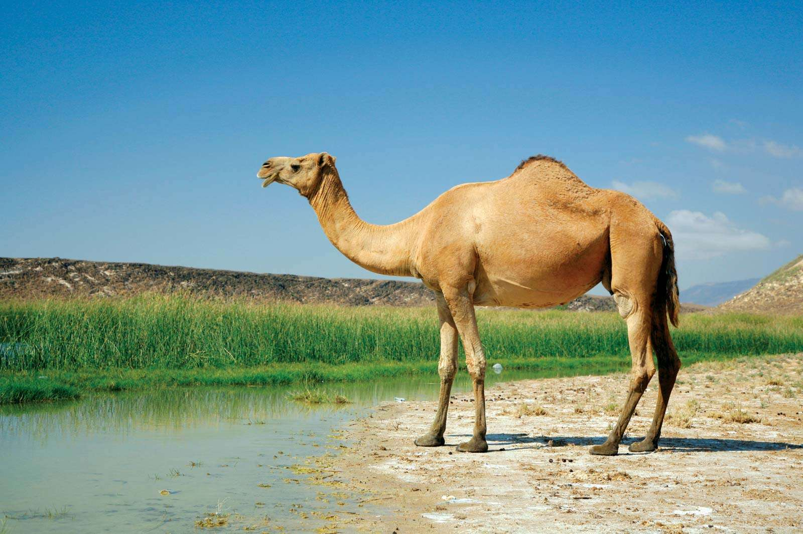
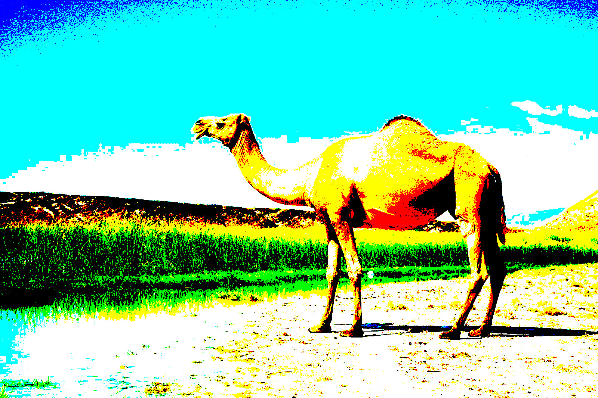
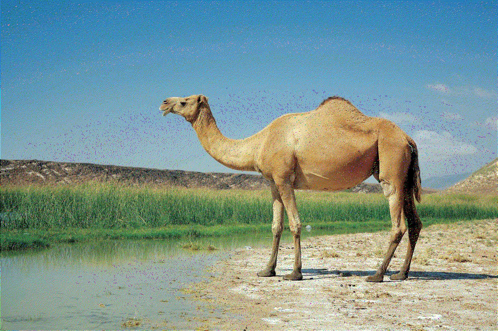

# Floyd-Steinberg Dithering

This is an implementation of the [Floyd-Steinberg dithering](https://en.wikipedia.org/wiki/Floyd%E2%80%93Steinberg_dithering) algorithm in OCaml.

## Usage

```sh
$ dune exec ./src/main.ml input-image.jpg output-image.jpg
```

## Example

Original Image (3 bytes per pixel):


No Dithering (1 bit per pixel):


Floyd-Steinberg Dithering (1 bit per pixel):

