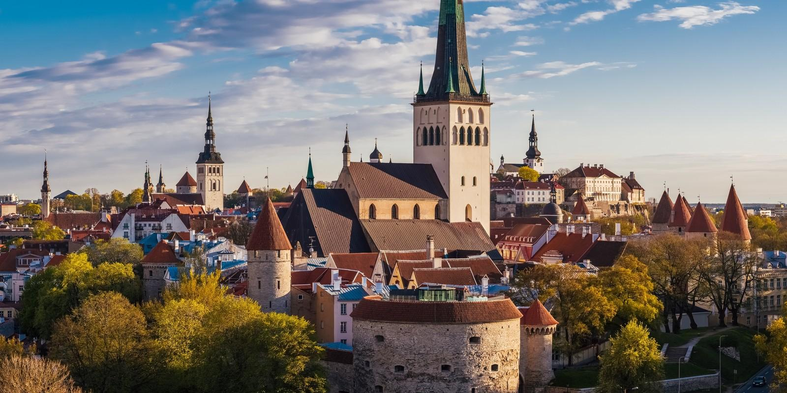
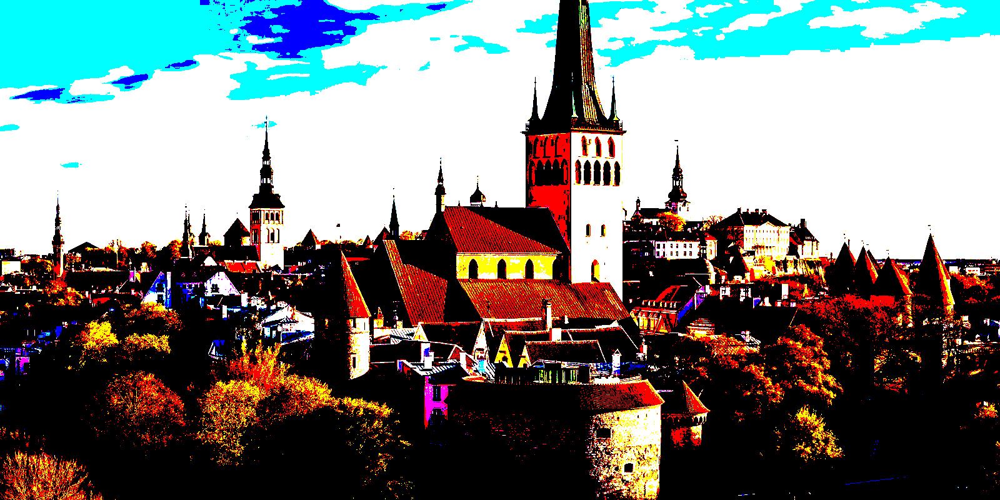
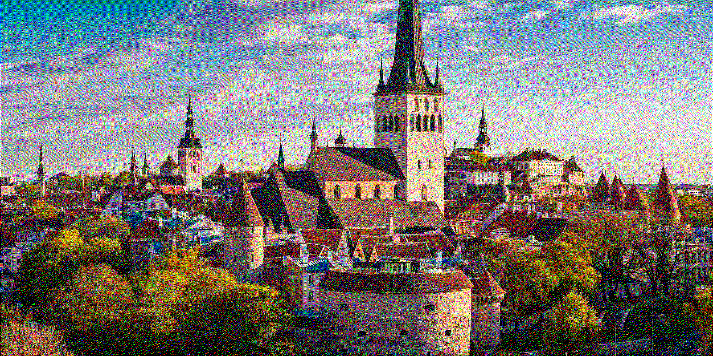
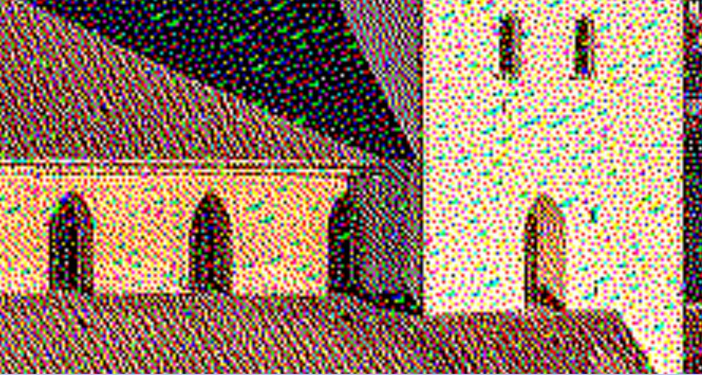

# Floyd-Steinberg Dithering

This is an implementation of the [Floyd-Steinberg dithering](https://en.wikipedia.org/wiki/Floyd%E2%80%93Steinberg_dithering) algorithm in OCaml.

## Usage

```sh
$ dune exec ./src/main.ml input-image.jpg output-image.jpg
```

## Example

**Original Image (3 bytes per pixel):**



**No Dithering (3 bits per pixel):**



**Floyd-Steinberg Dithering (3 bits per pixel):**



If you look closely on the image generated by the Floyd-Steinberg algorithm, you can see that the pixels have very "raw" colors (3 bits gives us just 8 colors)


